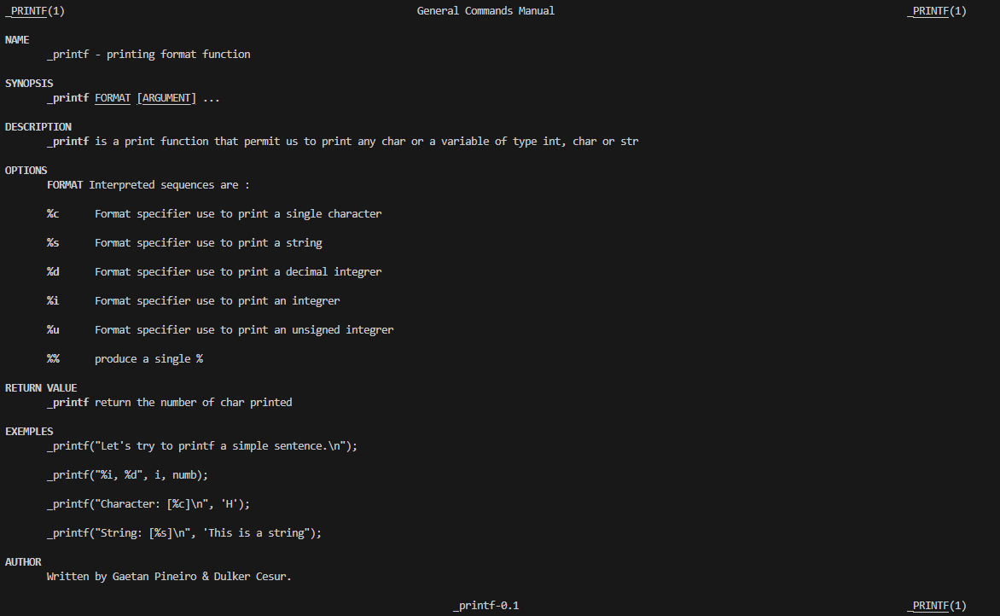

## Printf


# explanation of the printf project
Creation of the 'printf' code involves the intergration of 'putchar.c'. The 'fprint' function is useful for displaying simple text, variable values, and formatting the display of integer data, characters, strings and unsigned integrer values. it also allows combining text and variables effectively.
## Features
The main features of 'printf' is formatted display, precise format control which consists of width, precision and alignment of data. Versatility that can handle a variable number of arguments, debugging and logging useful for tracking variable states and program flow.

## The GCC 
The gcc use permit use to compile the printf function taking all .c files in the directory and creating a printf executable file.

``
gcc -Wall -Werror -Wextra -pedantic -std=gnu89 -Wno-format *.c -o printf
``

##
## use printf example
Exemple :
```c
printf("Hello, world!\n");
simple display of a charcter string
```
Terminal output :

.png>)

Another exemple :
```c
int number = 42;
printf("The answer is: %d\n", number); 
display of an integrer variable.
```
Terminal Output :

## 
**Here an exemple of the code :**


__and what this code is doing :__

## **Function declarations:**
``
printf_char``, ``printf_str``, ``printf_int``, ``printf_percent:`` Functions to handle different types of formatting (%c, %s, %d/%i, %%).

``printf_int_helper:`` Helper function to print integers.

``_putchar:`` Function to write a single character.

## **Implementations:**

``printf_char:`` *Prints a character from va_list.*

``printf_str:`` *Prints a string from va_list.*

``printf_int:`` *Handles printing of integers.*

``printf_percent:`` *Prints the '%' character.*

## **Fonction principale :**

``_printf :`` *Main function that parses the format string and call the printf_write function if a character '%' is found.*

``printf_write:``  *Secondary function that calls the appropriate functions for each specifier.*

## Manual page



## **Conclusion**

*This code forms a basic implementation of printf, capable of handling basic formats like %c, %s, %d, %i, and %%. It uses va_list to handle variable arguments, allowing flexibility similar to standard printf.*

## Contacts

printf project created by **Cesur Dulker** and **Gatean Pineiro**.


